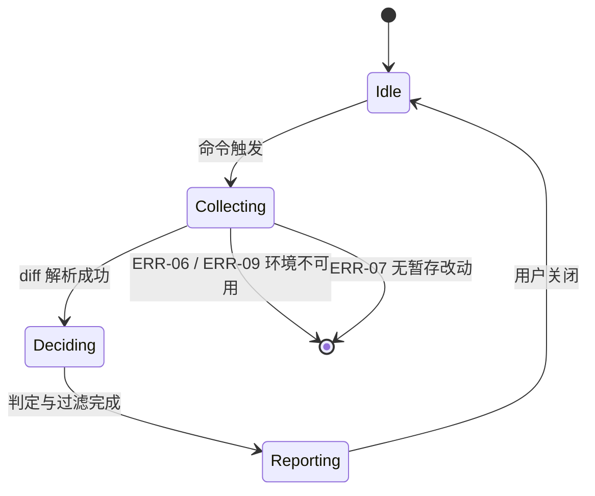

# v0.1.0 实现蓝图 — local-mvp

> 结构唯一权威：`dev-meta/docs/02-version-rules.md` §6。
> **本文件是唯一承载施工拆分的文档** —— `200-spec` / `300-design` 不得出现 Step 章节。
> 范围与验收见 `200-spec.md`；架构与算法见 `300-design.md`。

---

## 1. 通用约束

### 1.1 数据 Schema

- **存储结构**：本版**无持久化存储**。配置由 VS Code 托管（`workspace.getConfiguration("sonecheck")`），不落盘、不写文件。
- **key 命名规则**：`sonecheck.<camelCase>`，与 `03` §3 `CFG-01` 逐字一致：`riskThreshold` / `maxItems` / `enabled` / `sensitivePathPatterns`。
- **索引设计**：不适用。
- **运行时数据结构**（不落盘，仅进程内）：

| 类型 | 字段 | 说明 |
|---|---|---|
| `Hunk` | `filePath` / `startLine` / `diffContent` | diff 切块结果 |
| `HunkPayload` | `filePath` / `changeType` / `diffHunk` / `contextCode` | 出站请求体（**不含** `local_metadata`，见 `200-spec` §1.1） |
| `DecisionResult` | `score` / `decision` / `reasonCode` | 判定结果 |
| `RiskItem` | `filePath` / `startLine` / `score` / `reasonCode` | 清单条目（`INV-06` 要求可定位） |
| `SoneCheckConfig` | `riskThreshold` / `maxItems` / `enabled` / `sensitivePathPatterns` | 归一后配置 |

### 1.2 API 契约

> 契约规范与字段定义见 `dev-meta/docs/06-contract-based-dev.md` §2.1。

- **调用顺序**：`ui/commands` → `core/config.normalize` → `core/riskEngine.inspect` → `infra/git` → `infra/diffParser` → `core/contextBuilder` → `infra/jevClient` → `core/threshold` → `ui/riskList` / `ui/status`
- **前置条件**：
  - 调用 `inspect()` 前配置必须已归一（未归一的越界值不得进入判定）
  - 调用 `decide()` 前 payload 必须已满足 `INV-02`（单块 ≤ 2048 字节）
- **返回值约定**：
  - 纯函数式失败**返回空数组或原值**，**不返回 `null` / `undefined`**（依据 `dev-meta/docs/06` §5 失败面契约）
  - `inspect()` 恒返回 `RiskItem[]`（可能为空），不抛业务异常
  - `filterRisky()` 恒返回数组，排序稳定（同分按 `filePath` 字典序）

### 1.3 异常与边界

- **失败重试**：本版不适用（判定器为本地纯函数，无网络）
- **并发冲突**：本版不适用（顺序调用；并发上限 4 的实现留待 `v0.1.1`）
- **配额不足**：本版不适用
- **大数据量**：`context_code` 硬上限 2048 字节；hunk 总数不设上限，但清单条数由 `maxItems` 截断
- **异常归属**（`200-spec` §1 约定）：本地失败只落 `ERR-06` / `ERR-07` / `ERR-09`；其余异常向上抛至 `ui/commands` 提示一次后终止，**不静默吞**

### 1.4 防腐契约

> ID 沿用 `dev-meta/docs/06-contract-based-dev.md` §4.3 域-序号体系，**与契约层级 L1 / L2 / L3 无关**。

| ID | 拦截目标 | 校验命令 | 作用 |
|---|---|---|---|
| `GUARD-01` | `core/` 层出现 `vscode` 引用 | `grep -rn "from 'vscode'\|require('vscode')" src/core/ && exit 1 \|\| exit 0` | 守 `02` §1 单向分层 |
| `GUARD-02` | `getConfiguration` 出现在 `infra/configSource.ts` 之外 | `grep -rln "getConfiguration" src/ \| grep -v "infra/configSource.ts"` 须无输出 | 守配置读取唯一出口 |
| `GUARD-03` | 判定参数被硬编码 | `grep -rn "0\.85\|2048" src/ \| grep -v "constants.ts"` 须无输出 | 守 `INV-07` |
| `GUARD-04` | payload 超过 2048 字节 | 单测断言 `buildContext` 输出字节数 ≤ 2048 | 守 `INV-02` |
| `GUARD-05` | 清单项无法定位到真实行列 | 单测断言每个 `RiskItem` 的 `filePath` 与 `startLine` 可解析 | 守 `INV-06` |

> **扫描范围**：`GUARD-01` / `GUARD-03` 的 `grep` 只覆盖 `src/`。T1 单测位于 `test/`（见 `300-design` §7），故用例中出现的 `0.85` / `2048` 字面量不会被 `GUARD-03` 误判。

---

## 2. Step 0–7 施工清单

> 固定 8 行，**不得增删**。必做步（S0 / S1 / S6 / S7）不得标记 `⏭️ SKIPPED`。
> 「执行态」是设计决定；**进度状态**（⬜/🔄/✅）只写 `500-schedule.md`。

| Step | 名称 | 执行态 | 环节 | guard | 交付物 / 跳过理由 |
|---|---|---|---|---|---|
| S0 | Scaffold & Clean | 执行 | 开发 | — | TS 工程化就位：`tsconfig.json`、`src/`→`out/` 布局、三层目录与 Facade 骨架；删除 `extension.js` 与占位命令。**并显式登记：本版未启用轨迹观测点（O2 埋点整体归 `v0.1.1`）** |
| S1 | Contract & ADR | 执行 | 设计 | — | ADR-001（TS 迁移）/ ADR-002（mock 判定器与接口隔离）落盘；`infra/jevClient` 公开签名冻结；`03` 契约状态标注完成 |
| S2 | Core & Prototype | 执行 | 开发 | GUARD-03,04 | `parseDiff` / `buildContext` / `scoreHunk` 三个纯函数 + Harness 实测数据（分布、字节数、权重敏感性） |
| S3 | Standard Finalization | 执行 | 开发 | GUARD-03 | 用 S2 实测数据回填 `riskThreshold` / 上下文窗口参数 / payload 上限；`03` 的 `[PLANNED]` → `[CURRENT]` |
| S4 | Ingress Migration | 执行 | 开发 | GUARD-01,02 | 输入侧接线：命令注册 → 配置读取与归一 → `riskEngine` 编排 → `git` / `diffParser` / `jevClient` |
| S5 | Egress Migration | 执行 | 开发 | GUARD-05 | 输出侧接线：阈值过滤与 Top-K → QuickPick 清单 → 跳转定位；状态栏双态 |
| S6 | Guards & Tests | 执行 | 测试 | GUARD-01,02,03,04,05 | 5 条守卫全绿 + T1 全量单测通过 + 契约结构 lint 通过 |
| S7 | Verification & Close | 执行 | 发布 | — | 真机验收通过、`.vsix` 打包、Marketplace `0.1.0` 发布、版本 Issue 收口 |

> **粒度自检（硬判据）**：S4 / S5 **各只出现一次** ✅

---

## 3. Step 明细

### 3.1 S0 Scaffold & Clean

- **目标**：`extension/` 从纯 JS 占位变为可编译、可调试的 TypeScript 三层工程骨架，且不含任何业务逻辑。
- **步骤拆解**：
  1. 删除 `extension.js`；新建 `src/extension.ts`（仅 `activate` / `deactivate` 空壳）
  2. 新建 `src/ui/` `src/core/` `src/infra/` 三个目录与 `core/index.ts`、`infra/index.ts` 两个 Facade（先只放类型导出）
  3. 新增 `tsconfig.json`：`target: ES2022`、`module: commonjs`、`rootDir: ./src`、`outDir: ./out`、`strict: true`、`sourceMap: true`
  4. `package.json`：`main` 改 `./out/extension.js`；`contributes.commands` 从 `sonecheck.showStatus` 换为 `sonecheck.inspectDiff`；新增 `scripts`（`compile` / `watch` / `package`）；新增 `devDependencies`（`typescript ~5.7.0` / `@types/node ^22.0.0` / `@types/vscode` / `@vscode/vsce ^4.0` / `vitest ^5.0` / `msw ^2.15`）——**`@types/node` 必须锁 22.x 与宿主运行时对齐，禁止跟随 npm 最新大版本**
  5. `.vscodeignore` 增加 `src/`、`test/`、`tsconfig.json`、`**/*.map`
- **函数签名与伪代码**：

```text
export function activate(context: vscode.ExtensionContext): void
export function deactivate(): void
```

```text
activate(context):
  context.subscriptions.push(registerCommands())
```

- **输入输出与前置条件**：
  - 输入：扩展宿主传入的 `ExtensionContext`
  - 输出：无返回值；副作用是注册命令与订阅
  - 前置条件：`out/extension.js` 已由 tsc 产出
  - 后置条件：`npm run compile` 零错误，扩展可在 Extension Development Host 中加载
- **异常与边界**：
  - 异常场景：`out/` 缺失导致扩展加载失败
  - 回退策略：`package.json` 的 `scripts.package` 前置 `compile`，避免打包未编译产物

#### 关键行为契约

| 函数 | 场景 | 预期（given-when-then） |
|------|------|------------------------|
| `activate` | 扩展激活 | given 干净的 `out/` → when VS Code 加载扩展 → then 无异常抛出且命令已注册 |

### 3.2 S1 Contract & ADR

- **目标**：冻结 `infra/jevClient` 的公开签名（`v0.1.1` 换真实实现时不得变更），并把两项技术选型沉淀为 ADR。
- **步骤拆解**：
  1. 调 `dm-adr` 产出 **ADR-001**（扩展迁移 TypeScript + `src/out` 布局）与 **ADR-002**（mock 判定器与接口隔离策略）
  2. 在 `src/infra/jevClient.ts` 写死公开签名（本版为本地 mock 实现）
  3. 回写 `docs/03`：标注本版兑现的契约与生效的 `reason_code` 子集
- **函数签名与伪代码**：

```text
async function decide(payload: HunkPayload): Promise<DecisionResult>
// 前置条件：payload.contextCode 字节数 ≤ 2048（由调用方保证）
// 调用时机：riskEngine 对每个 Hunk 组装 payload 后
// 不变量（本版与 v0.1.1 共同遵守）：签名与 DecisionResult 字段不得变更
```

- **输入输出与前置条件**：
  - 输入：`HunkPayload`
  - 输出：`DecisionResult`（`score` ∈ [0,1]；`decision` ∈ {AUDIT, PASS}；`reasonCode` ∈ 五项枚举）
  - 前置条件：payload 已通过 `INV-02` 校验
  - 后置条件：同输入必得同输出（幂等）
- **异常与边界**：
  - 异常场景：`contextCode` 超限
  - 回退策略：由 `contextBuilder` 在组装阶段截断，`decide` 不再重复校验（单一职责）

#### 关键行为契约

| 函数 | 场景 | 预期（given-when-then） |
|------|------|------------------------|
| `decide` | 相同输入重复调用 | given 同一 `HunkPayload` → when 连续调用两次 → then 两次 `DecisionResult` 完全相等 |
| `decide` | 空 diff 内容 | given `diffHunk` 为空串 → when 调用 → then 返回 `decision = PASS` 且 `reasonCode = STYLE_ONLY`，不抛错 |

### 3.3 S2 Core & Prototype

- **目标**：在隔离环境中把三处纯逻辑抽成无 IO 依赖的函数，并用 Harness 跑出用于 S3 定阈值的真实数据。
- **步骤拆解**：
  1. `src/infra/diffParser.ts`：diff 文本 → `Hunk[]`
  2. `src/core/contextBuilder.ts`：括号配对作用域识别 + 固定窗口兜底 + 2048 字节截断
  3. `src/infra/jevClient.ts` 的 mock 实现：四维加权打分（权重见 `300-design` §4.2）
  4. Harness 脚本 `harness/measure.ts`：对**本项目 git 历史 diff** 与**构造样本仓库**跑统计，输出：hunk 数分布、四维命中率、score 分布、`context_code` 字节数分布
- **函数签名与伪代码**：

```text
function parseDiff(diffText: string): Hunk[]
function buildContext(hunk: Hunk, sourceLines: string[]): string
function scoreHunk(input: ScoreInput): DecisionResult
```

```text
buildContext(hunk, sourceLines):
  scope = findEnclosingScope(sourceLines, hunk.startLine)   // 括号配对回溯
  if scope is null:
    scope = fixedWindow(hunk.startLine, WINDOW_LINES)       // 兜底
  text = join(sourceLines[scope])
  return truncateToBytes(text, MAX_PAYLOAD_BYTES, keep = hunk 改动行)
```

- **输入输出与前置条件**：
  - 输入：diff 文本 / hunk 与源文件行数组
  - 输出：`Hunk[]` / 上下文字符串（≤ 2048 字节）
  - 前置条件：`sourceLines` 来自只读读取，不得修改
  - 后置条件：纯函数，无副作用，可重复调用
- **异常与边界**：
  - 异常场景：括号不平衡、单行文件、二进制文件、非 C 系语法
  - 回退策略：作用域识别失败一律走固定窗口兜底；解析失败返回 `[]`（不抛错）

#### 关键行为契约

| 函数 | 场景 | 预期（given-when-then） |
|------|------|------------------------|
| `parseDiff` | 空输入 | given `""` → when 调用 → then 返回 `[]`，不抛错 |
| `parseDiff` | 二进制文件 | given 含 `Binary files differ` 的 diff → when 调用 → then 跳过该文件，不出现在结果中 |
| `buildContext` | 括号不平衡 | given 无法定位作用域 → when 调用 → then 走固定窗口兜底，结果仍 ≤ 2048 字节 |
| `buildContext` | 超长作用域 | given 作用域超过 2048 字节 → when 调用 → then 从尾部长截，且改动行仍存在于结果中 |
| `scoreHunk` | 敏感路径命中 | given 路径含 `auth/` → when 调用 → then `score ≥ 0.4` 且 `reasonCode = AUTH_BOUNDARY` |
| `scoreHunk` | 仅样式改动 | given 只改空白与引号 → when 调用 → then `score < 阈值` 且 `reasonCode = STYLE_ONLY` |

### 3.4 S3 Standard Finalization

- **目标**：把 `03` 中所有预设阈值替换为 S2 实测得出的值，并完成契约状态翻牌。
- **步骤拆解**：
  1. 读取 Harness 输出（score 分布、字节数分布、权重敏感性）
  2. 定 `riskThreshold` 默认值（按分布取「低风险与高风险可分离」的分位点，留 1.5–2.5× 余量）
  3. 定上下文窗口兜底行数 `WINDOW_LINES` 与 `MAX_PAYLOAD_BYTES`
  4. 回写 `docs/03`：§3 的默认值、§1 的 `[PLANNED]` → `[CURRENT]`、§2.4 标注本版生效的 5 项枚举
- **输入输出与前置条件**：
  - 输入：S2 的实测数据集
  - 输出：更新后的契约数值与状态
  - 前置条件：实测样本量足以观察分布（本项目历史 + 构造样本双来源）
  - 后置条件：`03` 中不再存在无实测依据的判定阈值
- **异常与边界**：
  - 异常场景：分布双峰不明显，无法选出分离点
  - 回退策略：取保守高阈值（宁可漏报，不可噪音）并在 `03` 标注该取值的实测依据

### 3.5 S4 Ingress Migration

- **目标**：把「读 diff → 切块 → 判定」这条输入侧链路从纯函数接成可运行的命令。
- **步骤拆解**：
  1. `src/infra/git.ts`：`execSync('git diff --staged')`（只读）
  2. `src/infra/configSource.ts`：唯一读取 `workspace.getConfiguration` 的出口
  3. `src/core/config.ts`：越界回退默认、缺省补齐
  4. `src/core/riskEngine.ts`：串起 `git` → `diffParser` → `contextBuilder` → `jevClient`
  5. `src/ui/commands.ts`：注册 `sonecheck.inspectDiff`，统一异常提示（`ERR-06/07/09`）
  6. `src/extension.ts`：装配
- **函数签名与伪代码**：

```text
function readStagedDiff(cwd: string): string          // 失败抛 ERR-09
function readRawConfig(): RawConfig
function normalizeConfig(raw: RawConfig): SoneCheckConfig
async function inspect(config: SoneCheckConfig): Promise<RiskItem[]>
```

- **输入输出与前置条件**：
  - 输入：工作区根路径、原始配置
  - 输出：`RiskItem[]`（可能为空）
  - 前置条件：工作区为 git 仓库且存在暂存改动
  - 后置条件：工作区内容零变化（`INV-05`）
- **异常与边界**：
  - 异常场景：非 git 仓库（`ERR-06`）、git 缺失（`ERR-09`）、暂存区为空（`ERR-07`）
  - 回退策略：三者均提示一次后终止；其余异常上抛至 `ui/commands` 统一处理

#### 关键行为契约

| 函数 | 场景 | 预期（given-when-then） |
|------|------|------------------------|
| `normalizeConfig` | 阈值越界 | given `riskThreshold = 1.5` → when 归一 → then 回退为默认值且不抛错 |
| `inspect` | 无暂存改动 | given 空 diff → when 调用 → then 返回 `[]`，不抛业务异常 |
| `readStagedDiff` | 工作区只读性 | given 任意仓库状态 → when 调用 → then 调用前后 `git status --porcelain` 完全一致 |

### 3.6 S5 Egress Migration

- **目标**：把「过滤 → 展示 → 跳转」这条输出侧链路接通，并保证零打扰与可定位。
- **步骤拆解**：
  1. `src/core/threshold.ts`：阈值判定与 Top-K 排序（稳定排序）
  2. `src/ui/riskList.ts`：QuickPick 清单（`[score] 文件:行 · reason`）+ 跳转定位
  3. `src/ui/status.ts`：状态栏双态（检查中 / All Clear）
- **函数签名与伪代码**：

```text
function filterRisky(results: DecisionResult[], config: SoneCheckConfig): RiskItem[]
async function showRiskList(items: RiskItem[]): Promise<RiskItem | undefined>
function reportStatus(state: StatusState): void
```

```text
onInspectCompleted(items):
  if items.isEmpty: reportStatus(ALL_CLEAR); return
  picked = await showRiskList(items)
  if picked is not undefined: revealRange(picked.filePath, picked.startLine)
```

- **输入输出与前置条件**：
  - 输入：判定结果数组、归一配置
  - 输出：`RiskItem[]`（已排序截断）/ 用户选中的条目
  - 前置条件：`RiskItem` 的 `filePath` 与 `startLine` 均可解析到真实位置
  - 后置条件：清单中每项都可跳转（`INV-06`）
- **异常与边界**：
  - 异常场景：文件已被删除或行号越界
  - 回退策略：该条**不得进入清单**（在 `filterRisky` 阶段即剔除），而非展示后再失败

#### 关键行为契约

| 函数 | 场景 | 预期（given-when-then） |
|------|------|------------------------|
| `filterRisky` | 恰好等于阈值 | given `score === riskThreshold` → when 过滤 → then 该条**计入**清单（≥ 语义） |
| `filterRisky` | 超出条数上限 | given 命中 10 条、`maxItems = 3` → when 过滤 → then 只返回 score 最高的 3 条 |
| `filterRisky` | 结果不可定位 | given `filePath` 已不存在 → when 过滤 → then 该条被剔除，不出现在返回值中 |
| `filterRisky` | 全部低风险 | given 无命中 → when 过滤 → then 返回 `[]`，由调用方走零打扰分支 |

### 3.7 S6 Guards & Tests

- **目标**：5 条防腐守卫全绿，核心纯函数被 T1 单测覆盖，契约结构无违规。
- **步骤拆解**：
  1. 落 5 条守卫命令到 `package.json` 的 `scripts`
  2. 按 `300-design` §7 的 5 个 T1 关注点写单测（纯 Node，不加载 `vscode`）；同表 2 个 T3 场景在 S7 真机验证
  3. 跑契约结构 lint（若契约资产已拆分）
- **输入输出与前置条件**：
  - 输入：源码与测试
  - 输出：守卫全绿 + 单测全绿
  - 前置条件：S2–S5 已完成
  - 后置条件：`npm run guard` 与 `npm run test:unit` 均退出码 0（命令口径见 `01` §3；本版无 T2，故不涉及 `test:integration`）
- **异常与边界**：
  - 异常场景：守卫误报（如注释里出现 `getConfiguration` 字样）
  - 回退策略：守卫命令精确到 import 语句形态，避免子串误判

### 3.8 S7 Verification & Close

- **目标**：真机验收通过，产物发布，版本 Issue 收口。
- **步骤拆解**：
  1. `npm run compile` + `npx @vscode/vsce package`
  2. 在干净 VS Code 安装 `.vsix`，按 `200-spec` §2 逐项人工验收
  3. 发布 Marketplace `0.1.0`
  4. 勾选版本 Issue 的 Step checklist，输出追踪矩阵
- **输入输出与前置条件**：
  - 输入：已通过 S6 的分支
  - 输出：Marketplace 上的 `rolligen.sonecheck@0.1.0` + 收口报告
  - 前置条件：S6 全绿
  - 后置条件：版本 Issue 关闭条件齐备
- **异常与边界**：
  - 异常场景：Marketplace 审核延迟
  - 回退策略：先发 GitHub Release 附带 `.vsix`，Marketplace 待审核通过后补（`05` §4 风险表）

---

## 4. 风险与缓解

| 风险 | 影响 | 缓解措施 |
|---|---|---|
| mock 判定器的权重与真实场景偏差大 | 清单噪音或漏报，v0.1.0 价值验证失真 | S3 强制用双来源实测数据定案；权重集中在 `constants.ts` 便于调整 |
| 括号配对作用域识别在非 C 系语法上失效 | `context_code` 质量下降 | 固定窗口兜底；单测覆盖不平衡场景 |
| 本项目 git 历史缺少鉴权/支付类改动 | 实测分布偏斜 | Harness 增补构造样本仓库保证场景覆盖 |
| 移除占位命令后 Marketplace 上的 0.0.1 与新版本并存 | 用户可能装到空壳版 | S7 发布 `0.1.0` 时在 Release Note 说明取代关系 |
| TS 迁移后调试链路变化 | 首次真机验证可能卡在构建 | S0 后立即验证 Extension Development Host 能加载 |

---

## 5. 状态机 / 时序图

> 本版的跃迁已在 `300-design` §3 定义（`Idle` → `Collecting` → `Deciding` → `Reporting`），本版**无异步并发**，故不补充额外时序图。



---

## 6. 自检与验收

> 每 Step 提 PR 前跑：grep / 单测 / diff 行数。规范指针 `dm-contract-gate`。

- **S0**：`npm run compile` 零错误；Extension Development Host 能加载扩展
- **S1**：ADR-001 / ADR-002 已落盘；`03` 契约状态标注完成
- **S2**：Harness 产出分布数据；三个纯函数单测通过
- **S3**：`03` 中不再存在无实测依据的阈值；契约翻牌完成
- **S4**：`GUARD-01`（`core` 无 `vscode` 引用）、`GUARD-02`（配置读取唯一出口）全绿
- **S5**：`GUARD-05`（清单项可定位）全绿；真机点击跳转成功
- **S6**：5 条守卫全绿 + T1 全量单测通过 + 契约结构 lint 通过
- **S7**：真机验收 8 项全过；`.vsix` 已发布
- **S4 / S5 的顺序与并行说明**：S4 必须先行（S5 依赖 `inspect()` 的返回结构）；S5 内部的 `threshold` 可先于 UI 侧完成并单测
