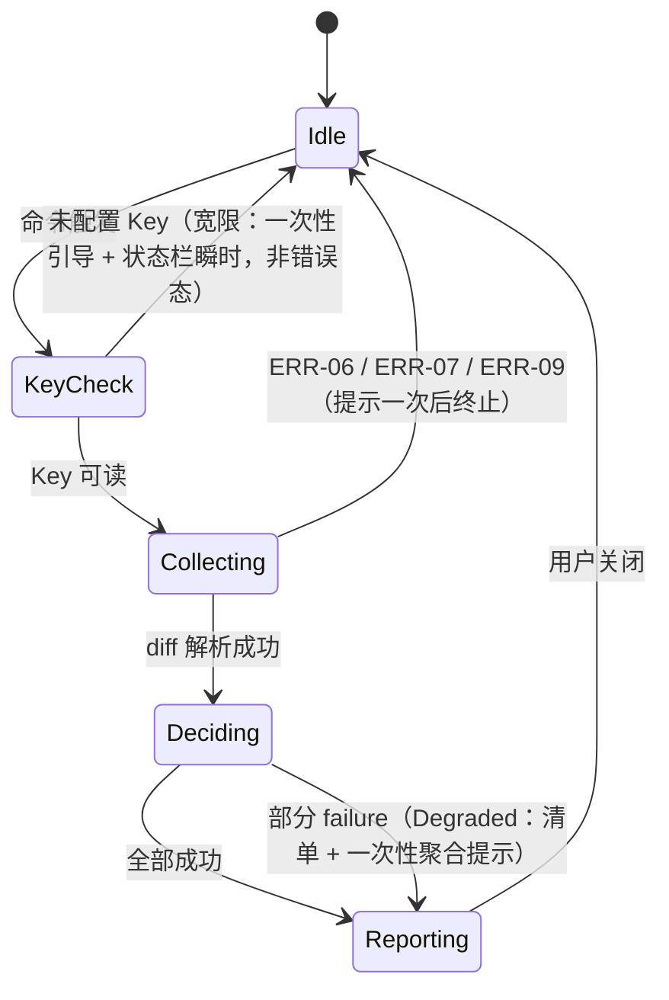

# v0.1.1 实现蓝图 — honest-jev

> 结构唯一权威：`dev-meta/docs/02-version-rules.md` §6。
> **本文件是唯一承载施工拆分的文档** —— `200-spec` / `300-design` 不得出现 Step 章节。
> 范围与验收见 `200-spec.md`；架构与算法见 `300-design.md`。

---

## 1. 通用约束

### 1.1 数据 Schema

- **存储结构**：新增 **SecretStorage** 一项（`sonecheck.jevApiKey`，OS 级密钥库，`INV-03`）；workspace 配置纯增量 `sonecheck.endpoint`；不落盘、不写文件。
- **key 命名规则**：`sonecheck.<camelCase>`，与 `03` §3 `CFG-01` 逐字一致；本版新增 `endpoint`。
- **运行时数据结构**（进程内）：

| 类型 | 字段 | 说明 |
|---|---|---|
| `Hunk` / `HunkPayload` / `SoneCheckConfig` | （同 `v0.1.0`） | `SoneCheckConfig` **纯增量** `endpoint: string`；`HunkPayload` 仍不含 `local_metadata` |
| `JevRequest` | `model` / `state` / `questions` | `API-01` 请求体外层（`state` 由 `serializePayload` 的四字段装入，`questions` 按 `03` §2.1 组装） |
| `JevResponse` | `model` / `answers` / `usage` | `API-01` 响应体；schema 校验失败 → `ERR-05` |
| `DecisionResult` | `score` / `decision` / `reasonCode` / **`failure?`** | **纯增量**可选 `failure`（`ERR-01`~`ERR-05`）；wire 契约不变（`300-design` §4.4） |
| `ScoredHunk` / `RiskItem` | （同 `v0.1.0`） | — |
| `SoneCheckConfig.endpoint` | — | 默认 `JEV_ENDPOINT_DEFAULT`（`constants.ts`）；空 / 非 https 归一回退 |

### 1.2 API 契约

> 契约规范见 `dev-meta/docs/06-contract-based-dev.md` §2.1。

- **调用顺序**：`ui/commands` → `infra/secrets`(可读性) → `core/config.normalize` → `core/riskEngine.inspect` → `infra/git` → `infra/diffParser` → `core/contextBuilder` → **并发 `infra/jevClient.decide`（≤4）** → `core/threshold` → `ui/riskList` / `ui/status`
- **前置条件**：
  - Key 未配置 → 检查**不进入** `inspect()`（宽限短路，`ADR-006`），不视为失败
  - `decide()` 前置条件同 `v0.1.0`（payload 序列化总长 ≤ 2048 字节，`INV-02`）
  - endpoint 必须已归一（空 / 非 https 回退默认）
- **返回值约定**：
  - `decide()` **恒 resolve**：成功返回 `DecisionResult`；失败返回含 `failure` 的降级结果——**不 reject、不抛未分类异常**（`INV-04` / `300-design` §4.4）
  - `inspect()` 恒返回 `RiskItem[]`（`failure` 块不入清单）；本地失败仍以分类失败（`ERR-06/07/09`）抛出
- **新增命令**：`sonecheck.setApiKey`（`API-03`）——幂等（最后写入为准）、取消无副作用、空串二次确认清除、任何路径不回显明文（`INV-03`）

### 1.3 异常与边界

- **失败重试**：仅 `429` / `529` 重试 1 次（退避 150ms，`ADR-007` 定案）；其余状态码不重试
- **并发**：在飞请求 ≤ 4（semaphore，`core/riskEngine`）；重复触发命令仍复用进行中 Promise（`v0.1.0` 语义）
- **超时**：单请求 400ms（`AbortController`）；超时 → `ERR-02`
- **配额 / 鉴权**：`401` / `429` / `529` → `ERR-04`（`429`/`529` 先重试）
- **schema 不合规**：该块 `failure: 'ERR-05'` 丢弃，**其余块不受影响**
- **大数据量**：payload 上限与 hunk 切分沿用 `v0.1.0`（`300-design` §4.3）
- **异常归属**：本地失败 `ERR-06/07/09` 抛分类失败；网络域失败一律经 `DecisionResult.failure` 走降级聚合，**两条通道不得混用**

### 1.4 防腐契约

> ID 沿用 `dev-meta/docs/06-contract-based-dev.md` §4.3 域-序号体系，与 L1/L2/L3 无关。

| ID | 拦截目标 | 校验命令 | 作用 |
|---|---|---|---|
| `GUARD-01` | `core/` 层出现 `vscode` 引用 | （同 `v0.1.0`） | 守单向分层 |
| `GUARD-02` | `getConfiguration` 出现在 `infra/configSource.ts` 之外 | （同 `v0.1.0`） | 配置唯一出口 |
| `GUARD-03` | 判定参数被硬编码 | `grep -rnE "\b0\.4\b\|\b2048\b\|\b400\b\|\b150\b" src/ \| grep -v "constants.ts"` 须无输出 | 守 `INV-07`（新增超时 / 退避字面量） |
| `GUARD-04` | payload 超过 2048 字节 | （同 `v0.1.0`，单测断言） | 守 `INV-02` |
| `GUARD-05` | 清单项无法定位 | （同 `v0.1.0`，单测断言） | 守 `INV-06` |
| `GUARD-06` | Key 明文泄漏 | `grep -rn "jevApiKey" src/ \| grep -v "infra/secrets.ts"` 须无输出 | 守 `INV-03`（本版新增） |

> `GUARD-06` 说明：`sonecheck.jevApiKey` 字符串本身不含 Key 明文，允许出现在 `package.json` 契约注记与 `infra/secrets.ts`；扫描范围为 `src/`。`tools/jev-mock/` 不在扫描范围（其内不涉及真实 Key）。

---

## 2. Step 0–7 施工清单

> 固定 8 行，**不得增删**。必做步（S0 / S1 / S6 / S7）不得标记 `⏭️ SKIPPED`。
> 「执行态」是设计决定；**进度状态**（⬜/🔄/✅）只写 `500-schedule.md`。

| Step | 名称 | 执行态 | 环节 | guard | 交付物 / 跳过理由 |
|---|---|---|---|---|---|
| S0 | Scaffold & Clean | 执行 | 开发 | — | `constants.ts` 增量（超时 / 退避 / 并发 / 默认 endpoint）；`tools/jev-mock/` 工程骨架（Worker 模块 + `wrangler.toml` + `.vscodeignore` 增列 `tools/`）；`package.json` 增 `test:integration` 占位与 `wrangler` devDependency。**显式登记：O2 埋点顺延，本版无运行期日志** |
| S1 | Contract & ADR | 执行 | 设计 | — | ADR-006 / ADR-007 核对回填（已落盘）；`03` 超时 / 重试定案与 `ERR-08` 语义回写；`API-03` 公开签名冻结（`setKey` / `getKey` / `clearKey`） |
| S2 | Core & Prototype | 执行 | 开发 | GUARD-03,04,06 | 真实 `jevClient`（wire 组装 / 超时 / 重试 / 归一 / `failure` 信号）+ `tools/jev-mock` 五类故障注入 + T2 契约测试骨架（五类故障全绿） |
| S3 | Standard Finalization | 执行 | 开发 | GUARD-03 | 并发上限 4 实测复核（仿真端点注入延迟场景）；`sonecheck.endpoint` 回写 `03` §3；翻牌第一批（`ERR-01`~`ERR-05` / `API-01` 真实链路 / `INV-04`，以 T2 证据为准） |
| S4 | Ingress Migration | 执行 | 开发 | GUARD-01,02,06 | `secrets.ts` 落地；`configSource` / `config` 增 `endpoint`；`riskEngine` 并发编排与 `failure` 剔除；`setApiKey` 命令注册 |
| S5 | Egress Migration | 执行 | 开发 | GUARD-05 | 宽限短路（一次性引导 + 状态栏瞬时态）；降级聚合提示；清单零变更复核（`04` §2 状态表对齐） |
| S6 | Guards & Tests | 执行 | 测试 | GUARD-01,02,03,04,05,06 | 6 条守卫全绿 + T1 基线（≥51 例）不降 + T2 全绿 + 契约结构 lint 全绿；`grep console.log src/` 须无输出 |
| S7 | Verification & Close | 执行 | 发布 | — | 真机八项验收（对仿真端点）、`.vsix` 打包、合并保留历史 + tag `v0.1.1`、Issue 收口；Marketplace 上架 `[DEFERRED]`（待 `VSCE_PAT`） |

> **粒度自检（硬判据）**：S4 / S5 **各只出现一次** ✅

---

## 3. Step 明细

### 3.1 S0 Scaffold & Clean

- **目标**：为本版提供常量、依赖与仿真端点的工程底座，不含业务逻辑。
- **步骤拆解**：
  1. `src/constants.ts` 增量：`REQUEST_TIMEOUT_MS = 400`、`RETRY_MAX_ATTEMPTS = 1`、`RETRY_BACKOFF_MS = 150`、`MAX_CONCURRENCY = 4`、`JEV_ENDPOINT_DEFAULT = 'https://api.typesafe.ai/v1/systemone'`（纯数据）
  2. 新建 `tools/jev-mock/`：`worker.mjs`（`export default { fetch }` 骨架）+ `wrangler.toml`（`name: jev-mock`、`main: worker.mjs`、`compatibility_date`）+ `README.md`（本地起服 / 部署 / 故障注入用法）
  3. `extension/package.json`：`devDependencies` 增 `wrangler`（仅 dev）；`scripts` 增 `test:integration` 占位（S6 填充）；`test` 聚合改为 `test:unit && test:integration`
  4. `extension/.vscodeignore` 增列 `tools/`（`tools/` 在仓库根，不在 `extension/`，此条为防御性登记；`vsce ls` 复核打包面不含仿真端点）
- **输入输出与前置条件**：前置 `v0.1.0` 工程基线；后置 `npm run compile` 零错误、`npx wrangler dev` 能起仿真端点并响应健康检查
- **异常与边界**：`wrangler` 首次运行需本地 workerd 下载——离线环境以 `README.md` 的纯 Node 兜底命令（`node tools/jev-mock/local.mjs`）替代（仿真逻辑同源复用）

#### 关键行为契约

| 函数 | 场景 | 预期（given-when-then） |
|------|------|------------------------|
| mock `fetch` | 无故障头 | given 无 `x-jev-mock-fault` → when POST 合法请求 → then 按 `03` §2.1 返回合规 `JevResponse` |
| mock `fetch` | 五类故障 | given 五种故障头 → when 调用 → then 分别复现 `ERR-01`~`ERR-05` 的上游行为 |

### 3.2 S1 Contract & ADR

- **目标**：把开工前已定案的契约变更（`ADR-006` / `ADR-007`）核对回写，并冻结 `API-03` 公开签名。
- **步骤拆解**：
  1. 核对 ADR-006 / ADR-007 已落盘且 `03` 的三处回写完成（超时 / 重试定案、`ERR-08` 宽限语义、`CFG-01` `sonecheck.endpoint` 纯增量）
  2. `src/infra/secrets.ts` 写死公开签名（此时仅签名，实现随 S4）
  3. 跑契约结构 lint 确认零漂移
- **函数签名与伪代码**：

```text
async function getKey(): Promise<string | null>          // SecretStorage 读取；未配置返回 null
async function setKey(value: string): Promise<void>      // 写入；空串走 clearKey（INV-03：不落盘明文）
async function clearKey(): Promise<void>
// 不变量：Key 明文只存在于本模块与 SecretStorage 之间；v0.1.2+ 不得变更签名
```

- **异常与边界**：SecretStorage 底层异常（如 OS 密钥库锁）→ 向上抛系统级异常，`ui/commands` 提示一次后终止——**不得**归入 `ERR-08`（那是「未配置」，不是「读不到」）

#### 关键行为契约

| 函数 | 场景 | 预期（given-when-then） |
|------|------|------------------------|
| `getKey` | 未配置 | given 空 SecretStorage → when `getKey` → then 返回 `null`，不抛错 |
| `setKey` | 写入后读取 | given 合法串 → when set 后 get → then 原值返回且存储介质非明文文件（SecretStorage 语义） |

### 3.3 S2 Core & Prototype

- **目标**：真实客户端与仿真端点在同一契约下互为镜像，T2 契约测试建立。
- **步骤拆解**：
  1. `src/infra/jevClient.ts` 重写：`createJevClient(deps)` 工厂（`deps = { endpoint, getKey, fetchImpl? }`，`fetchImpl` 供 T1 注入）；wire 组装、`AbortController` 超时、重试、五类归一、`failure` 信号（`300-design` §4.1–4.4）
  2. `tools/jev-mock/worker.mjs` 完整实现：合规响应 + `usage` + `model` 字段；五类故障注入
  3. `test/integration/jevContract.test.ts`：对仿真端点跑五类故障 + 超时 + 重试计数 + Key 泄漏断言（起服方式：vitest `beforeAll` 拉起 `wrangler dev --port <随机>` 或 `local.mjs` 子进程，`afterAll` 回收）
  4. `v0.1.0` 的 `scoreHunk` / `createMockJevClient` 移入 `test/fixtures/`（T1 打分用例改引 fixture，基线不降）
- **函数签名与伪代码**：

```text
interface JevClientDeps { endpoint: string; getKey: () => Promise<string | null>; fetchImpl?: typeof fetch }
function createJevClient(deps: JevClientDeps): IJevClient

async function decide(payload: HunkPayload): Promise<DecisionResult>
// 组装 JevRequest → fetch(AbortController 400ms) → 429/529 重试 1 次(150ms) → 解析/校验
// 任何失败路径：resolve { score: 0, decision: 'PASS', reasonCode: 'STYLE_ONLY', failure: 'ERR-0x' }
```

- **输入输出与前置条件**：输入 `HunkPayload`（`INV-02` 已满足）；输出 `DecisionResult`（含 `failure` 与否）；后置：同输入同输出（幂等，对无故障路径）
- **异常与边界**：`getKey()` 返回 `null` 不应到达 `decide`（宽限短路在更上游）；若到达，返回 `failure: 'ERR-08'` 兜底而非抛错

#### 关键行为契约

| 函数 | 场景 | 预期（given-when-then） |
|------|------|------------------------|
| `decide` | 正常响应 | given 仿真端点无故障 → when 调用 → then `score = answers.risk_score.noul`、`reasonCode = choice`、无 `failure` |
| `decide` | 连接失败 | given `fault: disconnect` → when 调用 → then resolve `failure: 'ERR-01'`，不 reject |
| `decide` | 超时 | given `fault: timeout`（>400ms）→ when 调用 → then `failure: 'ERR-02'` 且耗时 < 600ms |
| `decide` | 429 重试 | given `fault: rate429` → when 调用 → then 上游收到**恰好 2 次**请求（1 次 + 1 重试），最终 `failure: 'ERR-04'` |
| `decide` | schema 不合规 | given `fault: badschema` → when 调用 → then `failure: 'ERR-05'`，不抛错 |
| `decide` | Key 泄漏 | given 任意路径 → when 检查请求体与结果 → then 不含 Key 明文 |

### 3.4 S3 Standard Finalization

- **目标**：本版无待实测回填的判定阈值（`riskThreshold` 等沿用 `v0.1.0` 定案）；本步完成**并发上限复核**、`endpoint` 契约回写与第一批翻牌。
- **步骤拆解**：
  1. 用仿真端点注入 50/100/200ms 延迟，复核 `MAX_CONCURRENCY = 4` 下 ≥10 块的端到端耗时曲线（记录进 `500-schedule` 执行记录；并发值不做调整，4 为 `02` §4 既定设计）
  2. `03` §3 `sonecheck.endpoint` 行核对（随 ADR-007 开工前已回写，本步仅核对）
  3. 翻牌第一批：`ERR-01`~`ERR-05` / `API-01`（真实链路）/ `INV-04` → `[CURRENT]`（以 T2 全绿为证据）；`ERR-08` / `ERR-10` / `ERR-11` / `API-03` 留待 S5/S6 证据
- **异常与边界**：仿真端点延迟无法模拟真实公网长尾——以 `ADR-007` 的「真机校准待 Key」注记兜底，不在本版强定

### 3.5 S4 Ingress Migration

- **目标**：Key、配置、并发的输入侧接线全部打通，`setApiKey` 可用。
- **步骤拆解**：
  1. `src/infra/secrets.ts` 实现（S1 签名落地）；`src/extension.ts` 装配层把 `context.secrets` 注入 `secrets` 模块
  2. `src/infra/configSource.ts` 增读 `sonecheck.endpoint`；`src/core/config.ts` 归一（空 / 非 https → `JEV_ENDPOINT_DEFAULT`）
  3. `src/core/riskEngine.ts`：semaphore（≤4）批量 `decide`、结果按提交顺序聚合、`failure` 块剔除并收集归因集合；`inspect()` 前置 Key 可读性查询 → 未配置抛宽限信号（非分类失败，新内部信号 `NO_KEY`，由 `ui` 转宽限提示）
  4. `src/ui/commands.ts`：注册 `sonecheck.setApiKey`（输入框 `password: true`、取消无副作用、空串二次确认清除）；`inspectDiff` 接宽限信号
  5. `package.json` `contributes.commands` 增 `sonecheck.setApiKey`（title 与 `04` §1 一致）
- **函数签名与伪代码**：

```text
async function inspect(config, rootDir): Promise<RiskItem[]>   // failure 块不入清单
// 内部: keyReadable? -> no: 抛宽限信号; yes: 并发 decide(≤4) -> threshold.filterRisky
async function setApiKeyFlow(): Promise<void>                  // API-03 全流程（ERR-10/11 归属此处）
```

- **异常与边界**：`ERR-10`（取消）无副作用即静默返回；`ERR-11`（空串）二次确认 false → 保留原值；工作区只读不变（`INV-05`）

#### 关键行为契约

| 函数 | 场景 | 预期（given-when-then） |
|------|------|------------------------|
| `normalizeConfig` | endpoint 非 https | given `endpoint = 'http://x'` → when 归一 → then 回退默认且不抛错 |
| `inspect` | 并发上限 | given 20 个 payload + stub 每请求 50ms → when inspect → then 在飞峰值 ≤ 4 且总耗时 ≈ 250ms（非 1000ms） |
| `inspect` | 部分失败 | given 3/13 块 `failure: 'ERR-03'` → when inspect → then 返回 10 条有效清单 + 聚合信号含 `ERR-03` |
| `setApiKeyFlow` | 取消 | given 用户 Esc → when 流程结束 → then 原值不变、无提示残留 |

### 3.6 S5 Egress Migration

- **目标**：宽限引导与降级聚合的输出侧呈现，清单链路零回归。
- **步骤拆解**：
  1. `src/ui/status.ts`：增「未配置 Key」瞬时态（`SoneCheck: 未配置 Key`，2s）；一次性引导通知（`showInformationMessage(msg, '设置 Key')` → `executeCommand('sonecheck.setApiKey')`；**每会话至多一次**，以模块级会话标记实现，不持久化）
  2. `src/ui/commands.ts`：降级聚合提示——存在 `failure` 块时，清单照常弹出（有效结果优先），关闭清单后给一次性提示（含归因码，如 `SoneCheck: 已跳过 N 块（服务超时）`）；全部失败 → 不弹清单，仅提示
  3. `04` §2 状态表对齐复核（错误 / 降级 / 未配 Key 三态文案 SSOT）
- **输入输出与前置条件**：前置 S4 的宽限信号与聚合信号；后置 `200-spec` §2 前 4 项可真机走通
- **异常与边界**：引导通知只出现一次的粒度是「扩展会话」（重载窗口后允许再引导一次）——避免持久化状态与隐私问题

#### 关键行为契约

| 函数 | 场景 | 预期（given-when-then） |
|------|------|------------------------|
| 宽限 | 未配 Key 首次检查 | given 无 Key → when 检查 → then 一次性引导（带按钮）+ 状态栏瞬时提示，无错误态、无清单 |
| 宽限 | 未配 Key 第二次检查 | given 已见过引导 → when 再检查 → then 仅状态栏瞬时提示 |
| 降级 | 全部块失败 | given 全部 `failure` → when 检查 → then 不弹清单，一次性提示含归因码，状态栏瞬时 |

### 3.7 S6 Guards & Tests

- **目标**：6 条守卫全绿、T1 基线不降、T2 全绿、契约 lint 全绿；本版仍无运行期日志（`grep -rn "console.log" src/` 须无输出）。
- **步骤拆解**：
  1. `guard:06`（Key 泄漏）落盘并入聚合 `guard`；`GUARD-03` 模式增补 `400` / `150` 字面量
  2. `test:integration` 填充（S2 骨架 → 全量：五类故障 / 超时 / 重试计数 / Key 泄漏 / 并发峰值）；`npm run test` 聚合 = `test:unit && test:integration`
  3. T1 基线核对：≥51 例 / 8 文件，逐用例比对 `v0.1.0` 清单（删除或跳过须在 §2 标注理由）
  4. 契约结构 lint（无条件必跑）：`python3 ~/dev/dev-meta/samples/contract-lint/contract_lint.py --root . --contract-file docs/03_CONTRACTS_AND_API.md`
- **后置条件**：`npm run guard`、`npm run test:unit`、`npm run test:integration`、契约 lint 均退出码 0

### 3.8 S7 Verification & Close

- **目标**：真机验收（对仿真端点）、产物与版本收口。
- **步骤拆解**：
  1. `npm run compile` + `npx @vscode/vsce package`；`vsce ls` 复核不含 `tools/` 与 Key 相关面
  2. 起仿真端点（`npx wrangler dev` 或已部署 Worker）；干净 VS Code 安装 `.vsix`，设置 `sonecheck.endpoint` 指向仿真端点，按 `200-spec` §2 逐项人工验收（八项）
  3. 契约结构 lint 全绿（关版本门禁，与 S6 同命令）
  4. 合并回 `main`（**保留完整提交历史，禁止 squash**；优先 `git merge --ff-only`）+ 打 annotated tag `v0.1.1` 并推送
  5. 勾选版本 Issue 的 Step checklist，输出追踪矩阵；Marketplace 上架 `[DEFERRED]`（待 `VSCE_PAT`）与「真机校准待 Key」一并登记到 Issue 评论与 `500-schedule` 执行记录
- **异常与边界**：wrangler 本地起服失败 → 改用已部署 Worker URL（`sonecheck.endpoint` 指向）；两者都不可用 → 验收挂起，不得降级为「仅 T2 即收口」

---

## 4. 风险与缓解

| 风险 | 影响 | 缓解措施 |
|---|---|---|
| 仿真响应与真实上游 schema 漂移 | 真实接入时归一逻辑失效 | 仿真实现以 `03` §2.1 为唯一权威；T2 用例字段级断言；真机校准（Key 到位后）以真实响应对照 |
| Cloudflare 账号 / wrangler 环境不可用 | 仿真端点无法部署或本地起服 | `wrangler dev` 本地模式不需要账号；再退化用 `local.mjs` 纯 Node 兜底（同源逻辑） |
| 并发 4 下仿真端点限流 | T2 假阳性（把本地限流当上游限流） | 仿真端点不限流；`rate429` 只经故障头显式注入 |
| 一次性引导的会话标记过弱 | 用户错过引导后 discoverability 下降 | 文档（`04` §2）+ `setApiKey` 命令常驻命令面板；真机验收项 2 显式覆盖 |
| 真实端点延迟远超定案值 | 真机校准时需调整超时/退避 | 只动 `constants.ts` 与 `03` 注记（`ADR-007` 预案），结构零改动 |

---

## 5. 状态机 / 时序图

> 跃迁定义见 `300-design` §3（新增 `Degraded` 分支与宽限短路）。本版存在异步并发，补充判定段时序：



---

## 6. 自检与验收

> 每 Step 提 PR 前跑：grep / 单测 / T2 / diff 行数。规范指针 `dm-contract-gate`。

- **S0**：`npm run compile` 零错误；`wrangler dev` 起服并通过健康检查
- **S1**：ADR-006 / ADR-007 已登记；`03` 三处回写完成；`secrets` 签名冻结；lint 零漂移
- **S2**：T2 五类故障 + 超时 + 重试 + Key 泄漏断言全绿；`scoreHunk` 移入 fixture 后 T1 基线不降
- **S3**：并发复核数据已记录；第一批翻牌完成（以 T2 证据为准）
- **S4**：`GUARD-01/02/06` 全绿；`setApiKey` 全流程（写入 / 取消 / 清除）真机可用
- **S5**：宽限两态与降级聚合真机可用；`GUARD-05` 全绿
- **S6**：6 条守卫 + T1（≥51 例）+ T2 + 契约 lint 全绿；无 `console.log`
- **S7**：`200-spec` §2 八项真机验收全过；`.vsix` 产出；`v0.1.1` annotated tag 已推送（上架 `[DEFERRED]` 待 `VSCE_PAT`）
- **顺序说明**：S2 必须先行（T2 证据是 S3 翻牌前提）；S4 先于 S5（宽限信号与聚合信号由 S4 产出）
